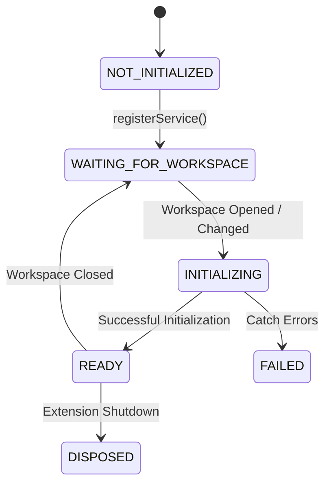

# Workspace Lifecycle Report

## 1. Overview
Previously, every workspace-dependent service inside Sasta-Antigravity immediately attempted to access vscode workspace folders on extension activation, throwing a `"No workspace folder is open"` exception if launched without an open folder.

This architecture issue has been resolved by implementing a **Lazy Workspace Lifecycle Management Pattern**. The extension now activates cleanly with zero workspace folders open, and automatically initializes all registered services once a workspace becomes available.

---

## 2. Workspace State Diagram
Services transition between states governed by the centralized `WorkspaceLifecycleManager`:

---

## 3. Lifecycle States Definition

| State | Description |
| :--- | :--- |
| **`NOT_INITIALIZED`** | Service is instantiated but has not registered with the manager yet. |
| **`WAITING_FOR_WORKSPACE`** | Service is registered, but no vscode workspace folders are open. |
| **`INITIALIZING`** | Workspace folder is detected; service is instantiating its active execution engine. |
| **`READY`** | Active engine is successfully initialized, and all deferred subscriptions are flushed. |
| **`DISPOSED`** | Extension is deactivated, clean up memory buffers. |
| **`FAILED`** | Service failed to initialize due to permissions or missing directory errors. |

---

## 4. Refactored Services
The following 14 workspace-dependent services were successfully refactored to implement `ILazyWorkspaceService`:

1.  **GitService** (`src/core/git/gitService.ts`)
2.  **VectorStoreService** (`src/core/vectorStore/vectorStoreService.ts`)
3.  **ToolService** (`src/core/toolCalling/toolService.ts`)
4.  **TerminalService** (`src/core/terminal/terminalService.ts`)
5.  **RollbackService** (`src/core/rollback/rollbackService.ts`)
6.  **RetrieverService** (`src/core/retriever/retrieverService.ts`)
7.  **PromptAssemblyService** (`src/core/promptAssembly/promptAssemblyService.ts`)
8.  **PermissionService** (`src/core/permission/permissionService.ts`)
9.  **PatchService** (`src/core/patch/patchService.ts`)
10. **FilesystemService** (`src/core/filesystem/filesystemService.ts`)
11. **EmbeddingService** (`src/core/embedding/embeddingService.ts`)
12. **DiagnosticsService** (`src/core/diagnostics/diagnosticsService.ts`)
13. **ContextService** (`src/core/context/contextService.ts`)
14. **CheckpointService** (`src/core/checkpoint/checkpointService.ts`)

---

## 5. Webview Message Router Deferrals
*   **Indexer Engine**: Refactored `getIndexerEngine()` to return `null` instead of throwing an exception.
*   **Webview Subscriptions**: Constructor registers a state listener via `workspaceLifecycleManager.onDidChangeState()`. It delays calling `initXSubscription()` routines until the lifecycle state transitions to `'READY'`.
